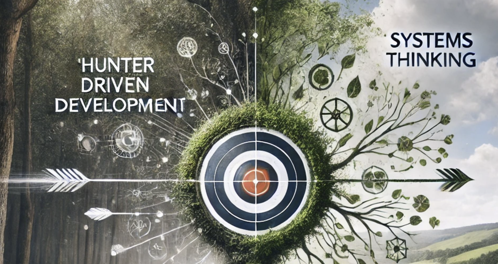

# Sharpshooter and Strategist

<!-- more -->
## Balancing Hunter Driven Development and Systems Thinking for Long-Term Success

In the fast-paced tech world, **Hunter Driven Development**—a relentless focus on hitting targets—powers groundbreaking innovation and fuels rapid achievements. To turn these wins into lasting success, we must also prepare for long-term sustainability, ensuring our bold strides today lay the foundation for future growth.

That's where **Systems Thinking** comes in. Systems Thinking complements Hunter Driven Development by providing a broader perspective to foresee potential issues and support sustainable growth. This ensures that rapid innovation leads to lasting benefits.

### The Synergy of Hunter Driven Development and Systems Thinking

- **Hunter Driven Development**: Zeroing in on the goal with urgency, adaptability, and determination. Think rapid prototyping, quick pivots, and outcome-driven decisions ⚡.
- **Systems Thinking**: Stepping back to understand the broader context, identifying feedback loops 🔁, and addressing potential unintended consequences. 🎾

By combining these approaches, you can achieve groundbreaking innovation while also ensuring long-term stability and growth. For example, launching a new feature quickly (Hunter Driven Development) without considering the broader system impacts could lead to issues like server crashes and frustrated users. But with Systems Thinking, you anticipate these challenges by planning for infrastructure capacity, user growth, and support needs. This allows you to implement scalable solutions and a phased rollout to maintain balance across the system, ensuring both immediate success and long-term sustainability.

### Synergy
This synergy of Hunter Driven Development and Systems Thinking is more than just a strategy—it's a mindset. It's about being both the sharpshooter and the strategist, making every move count toward long-term success.

---

🔗 What do you think?

#HunterDrivenDevelopment #SystemsThinking #Leadership #Innovation #Strategy #HolisticThinking

