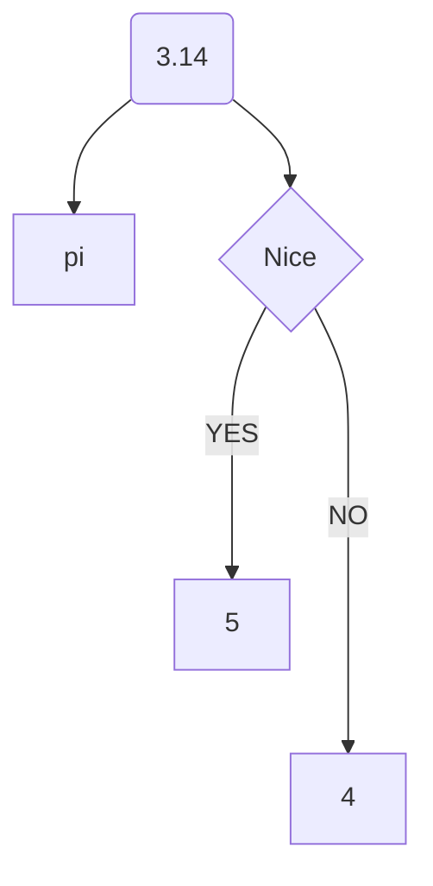

# My First Blog Post


```py title="code-example" linenums="1" hl_lines="2"
async def nice(int):
    return int * 3.14

```

## How would this look in a mermaid diagram?


```mermaid
graph TD

1(3.14)-->2[pi]
1(3.14)-->3{Nice}
3--NO---->4
3--YES--->5
```


<!-- more -->