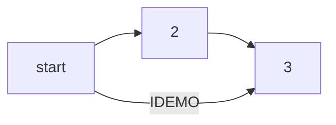

# Code example

## Function to add two numbers
python title="Add numbers" linenums="5" hl_lines="2"
def add_two_numbers(num1, num2):
    return num1 + num2
```
## Example usage :heart:

```py
result = add_two_numbers(5, 3)
print('The sum is:', result)
```

```js title="code-examples.py" linenums="1" hl_lines="2-4"
// Function to concatenate two strings
function concatenateStrings(str1, str2) {
  return str1 + str2;
}

// Example usage
const result = concatenateStrings("Hello, ", "World!");
console.log("The concatenated string is:", result);
```

