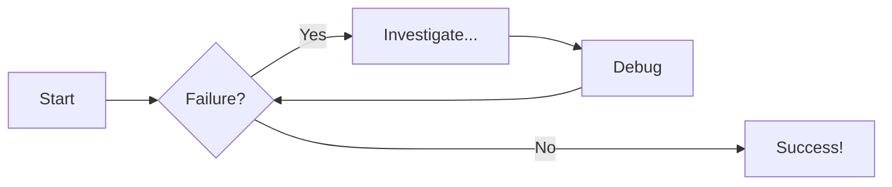
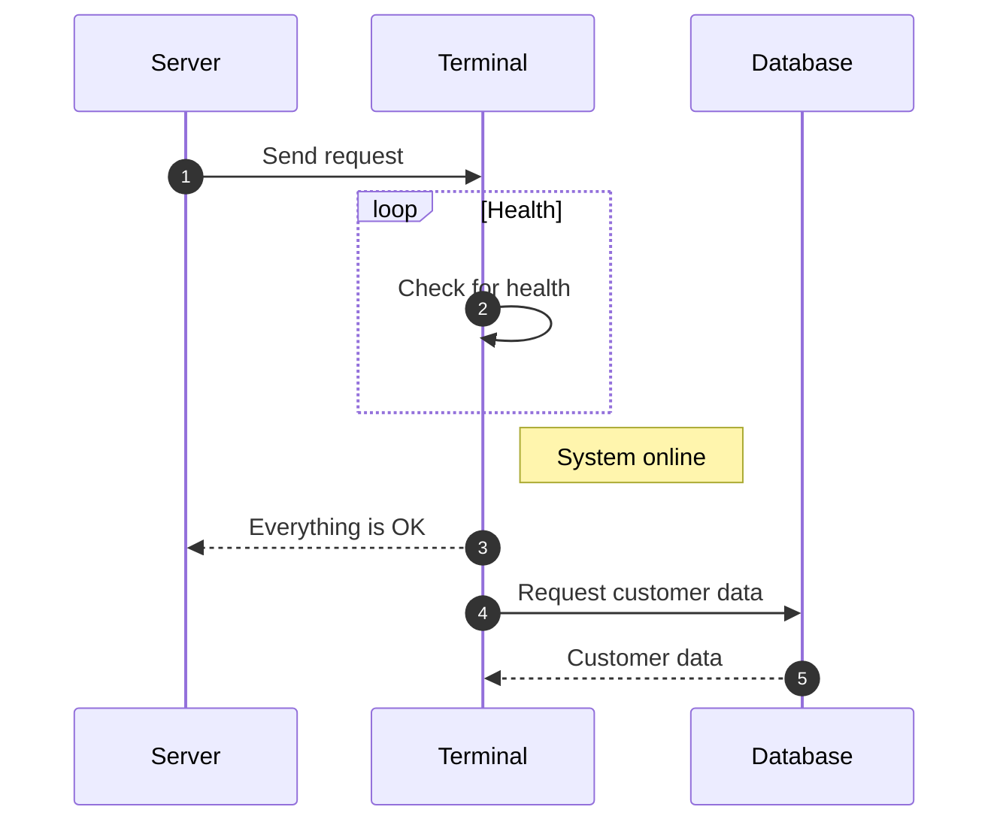
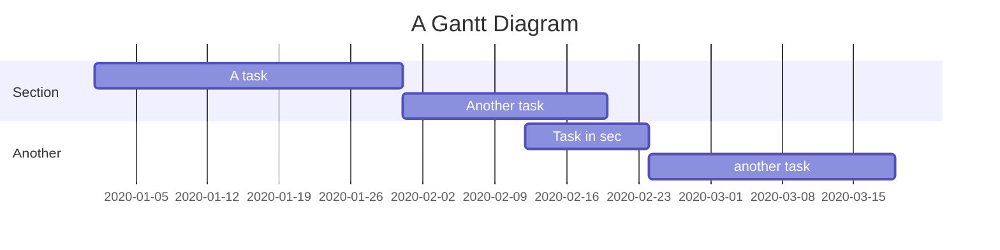
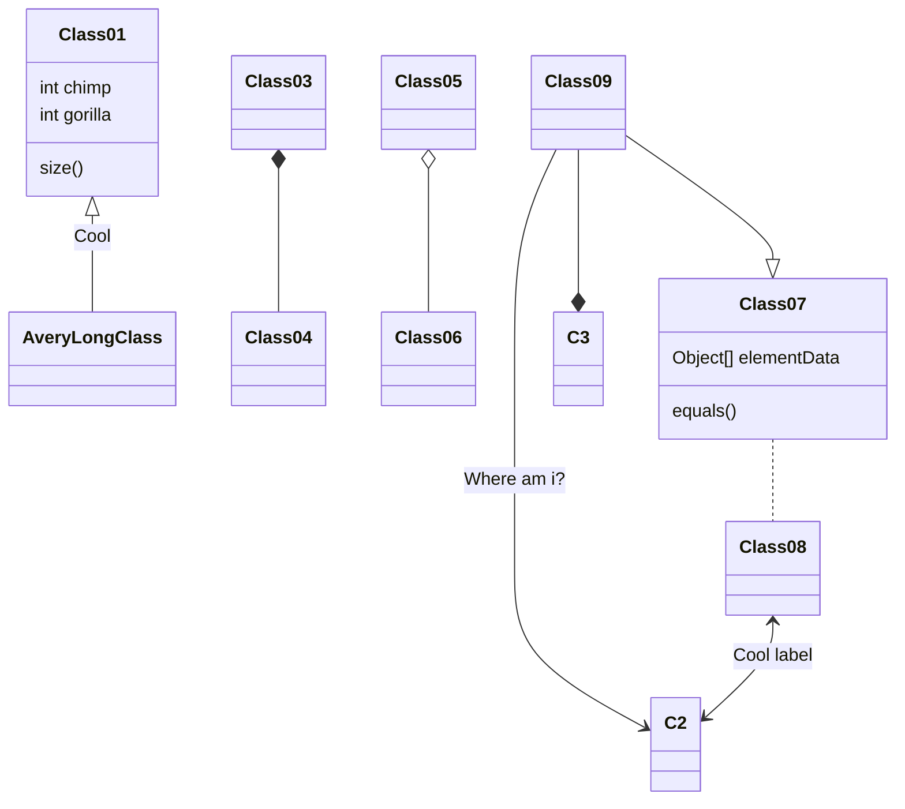
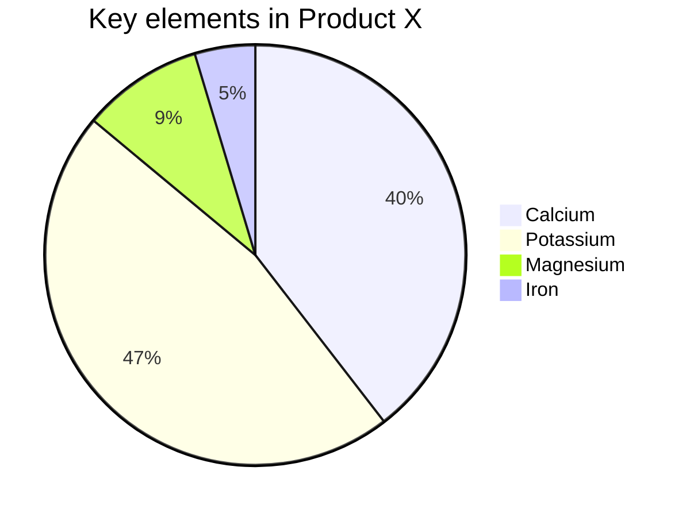

# Diagrams

## Flowcharts

```mermaid
graph LR
  A[Start] --> B{Failure?};
  B -->|Yes| C[Investigate...];
  C --> D[Debug];
  D --> B;
  B ---->|No| E[Success!];
```
## Sequence

```mermaid
sequenceDiagram
  autonumber
  Server->>Terminal: Send request
  loop Health
      Terminal->>Terminal: Check for health
  end
  Note right of Terminal: System online
  Terminal-->>Server: Everything is OK
  Terminal->>Database: Request customer data
  Database-->>Terminal: Customer data
```

## Gantt

```mermaid
gantt
title A Gantt Diagram
dateFormat  YYYY-MM-DD
section Section
A task           :a1, 2020-01-01, 30d
Another task     :after a1  , 20d
section Another
Task in sec      :2020-02-12  , 12d
another task     : 24d
```

## Class Diagram

```mermaid
classDiagram
  Class01 <|-- AveryLongClass : Cool
  Class03 *-- Class04
  Class05 o-- Class06
  Class07 .. Class08
  Class09 --> C2 : Where am i?
  Class09 --* C3
  Class09 --|> Class07
  Class07 : equals()
  Class07 : Object[] elementData
  Class01 : size()
  Class01 : int chimp
  Class01 : int gorilla
  Class08 <--> C2: Cool label
```

## Pie

```mermaid
pie
    title Key elements in Product X
    "Calcium" : 42.5
    "Potassium" : 50
    "Magnesium" : 10
    "Iron" : 5
```